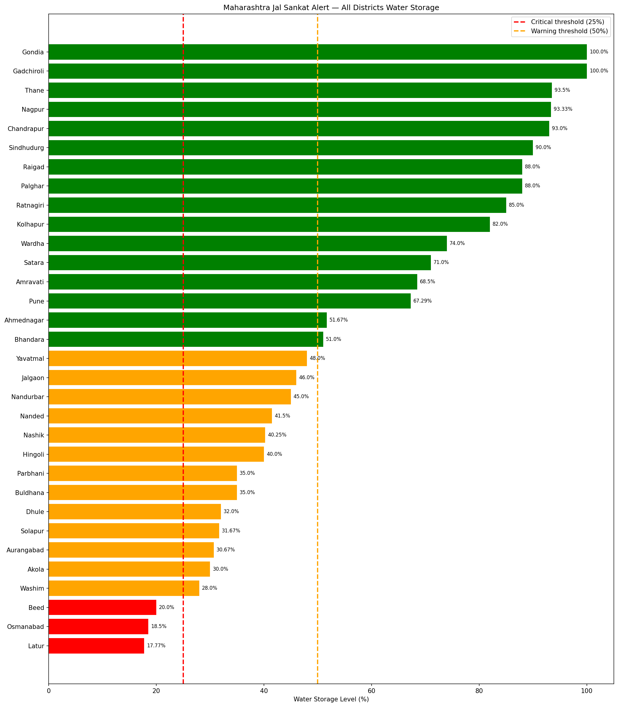

# Maharashtra Jal Sankat Alert 🌊
### AI-powered water shortage early warning system for Maharashtra

---

## The Problem

Every summer, millions of farmers and families across Maharashtra wake up to dry taps, empty wells, and dried-up fields — with no warning.

A farmer in Latur plans his entire crop season around water from the local dam. But by March, the dam is at 17%. His crops fail. His income collapses. He had no way to know this was coming.

A family in Osmanabad pays Rs 600 per drum of water from a tanker in May — money they do not have — because nobody warned them in February to store water carefully.

**The crisis is not sudden. The data exists. The warning just never reaches the people who need it.**

---

## Our Solution

**Maharashtra Jal Sankat Alert** monitors reservoir levels across all 32 districts of Maharashtra and predicts — 60 days in advance — which districts face water shortage.

Every district gets a clear alert:

- 🔴 **RED** — Critical shortage coming. Farmers should not start water-intensive crops. Families should begin storing water now.
- 🟡 **AMBER** — Warning zone. Monitor usage carefully. Prepare as a precaution.
- 🟢 **GREEN** — Safe. Normal water usage can continue.

No technical knowledge needed to understand the output. A farmer, a village sarpanch, or a district collector can all read this in 5 seconds.

---

## Who This Helps

- 👨‍🌾 **Farmers** — Plan crop cycles based on predicted water availability. Avoid planting water-intensive crops when shortage is coming.
- 👨‍👩‍👧 **Families** — Get early warning to store water before shortage hits. Avoid paying Rs 600/drum from tankers.


---

## Impact

## Impact

> *In 2025, Latur district dams dropped to 17.77% — RED alert.*
> *If this system existed, farmers would have known in January.*
> *They could have switched to drought-resistant crops.*
> *Families could have stored water in February.*
> *The crisis would still come — but the people would be ready.*

---

## Maharashtra Water Alert Map — All 32 Districts



### Current Alert Status (May 2026)
- 🔴 **Critical:** Latur (17.77%), Osmanabad (18.5%), Beed (20%)
- 🟡 **Warning:** 13 districts including Nashik, Aurangabad, Solapur, Akola, Washim
- 🟢 **Safe:** 16 districts including Pune, Nagpur, Kolhapur, Konkan region

---

## How It Works

```
Real government dam data (CWC + WRD Maharashtra)
            ↓
Automated data pipeline loads all 32 districts
            ↓
ML model predicts shortage risk 60 days ahead
            ↓
Clear RED / AMBER / GREEN alert per district
            ↓
Dashboard shows every farmer and family what is coming
```

---

## What's Built So Far

| File | What it does |
|---|---|
| `reservoir.py` | Digital model of any Maharashtra dam — level, alert, days to critical |
| `district.py` | District-level analysis — average storage, risk, days of water remaining |
| `data_loader.py` | Loads real government CSV data automatically into the system |
| `visualiser.py` | Generates color-coded alert charts for all 32 districts |
| `maharashtra_all_districts.csv` | Real data — 32 districts, 67 dams, government sources |

---

## Project Status

```
✅ Phase 1 — OOP foundation + data pipeline
✅ Phase 2 — All 32 districts modelled and visualised
🔨 Phase 3 — ML model for 60-day shortage prediction (in progress)
⬜ Phase 4 — Streamlit dashboard for farmers and district officials
```

---

## Tech Stack

- **Python** — core data pipeline and OOP foundation
- **Pandas + NumPy** — data processing and feature engineering
- **Scikit-learn + XGBoost** — shortage prediction ML models
- **LSTM (PyTorch)** — time series reservoir level forecasting
- **SHAP** — explainability — why is this district flagged RED?
- **Streamlit** — live dashboard for farmers and administrators

---

## Data Sources

| Source | Data |
|---|---|
| CWC India (`cwc.gov.in`) | Daily reservoir storage levels |
| WRD Maharashtra (`wrd.maharashtra.gov.in`) | Dam-wise live storage % |
| IMD (`data.gov.in`) | District-wise daily rainfall |
| India WRIS (`india-wris.nrsc.gov.in`) | Historical drought records |

---

## Run It Yourself

```bash
git clone https://github.com/Mandlik-Sanskruti-Santosh/maharashtra-jal-sankat-alert.git
cd maharashtra-jal-sankat-alert
pip install -r requirements.txt
cd src/data
python main.py
```

---

## Author

**Sanskruti Mandlik** — Aspiring ML Engineer, Pune
BSc Computer Science 2026

*Building AI that serves real people — not just benchmarks.*