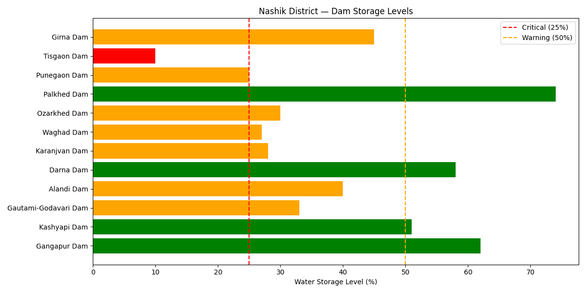

# Maharashtra Jal Sankat Alert 🌊

An ML-powered early warning system that predicts water shortage 
risk for Maharashtra districts 60 days in advance.

## The Problem
Maharashtra faces a water crisis every year. In 2025, dam levels 
dropped to 41.3% across the state. 606 hamlets were caught 
off-guard and forced to pay Rs 600 per drum from tankers.
No early warning system exists. Preparation always happens too late.

## Our Solution
A machine learning system that monitors 2,997 Maharashtra dams,
predicts district-level shortage risk 60 days ahead, and gives
a clear Green / Amber / Red alert per district — updated weekly.

## Impact
If this system existed in 2024, the 606 hamlets that faced 
sudden water shortage could have prepared 60 days earlier.

## Tech Stack
- Python, NumPy, Pandas
- Scikit-learn, XGBoost
- LSTM (PyTorch)
- SHAP for explainability
- Streamlit for dashboard

## Data Sources
- CWC India — daily reservoir storage
- IMD — district-wise rainfall
- WRD Maharashtra — live dam storage %
- India WRIS — historical drought data

## Project Status
🔨 Phase 1 in progress — Building data pipeline and OOP foundation

## Current Status — Nashik District

## Author
Sanskruti Mandlik — Aspiring ML Engineer, Pune